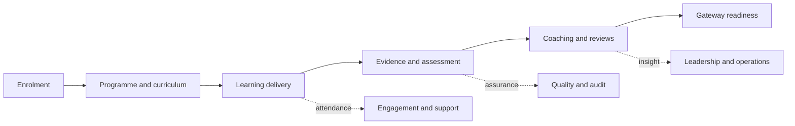
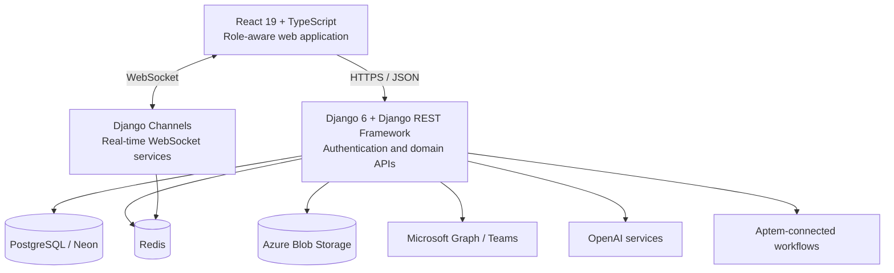

<div align="center">
  

  <h1>KBC LearningOS</h1>

  <p>
    <strong>The connected operating system for apprenticeship delivery.</strong>
  </p>

  <p>
    Bring learning, coaching, curriculum, evidence, compliance, quality,<br />
    and operational insight into one role-aware platform.
  </p>

  <p>
    
    
    
    
    
  </p>

  <p>
    <a href="#product-overview">Overview</a> ·
    <a href="#capabilities">Capabilities</a> ·
    <a href="#architecture">Architecture</a> ·
    <a href="#getting-started">Getting started</a> ·
    <a href="#engineering-quality">Quality</a>
  </p>
</div>

---


## Product overview

KBC LearningOS is Kent Business College's apprenticeship management and learning
platform. It gives learners, delivery teams, employers, quality staff, and
operations teams a shared view of the apprenticeship journey—from enrolment and
curriculum planning through learning, evidence, reviews, attendance, and gateway
readiness.

The product is built around a simple principle: every workspace should show the
right person the right information without breaking learner ownership, programme
context, or the historical audit trail.

| | |
| --- | --- |
| **Organisation** | Kent Business College |
| **Product type** | Apprenticeship management and learning platform |
| **Experience** | Role-aware React single-page application |
| **Application layer** | Django REST and WebSocket services |
| **Primary data layer** | PostgreSQL/Neon with Redis-backed services |
| **Key integrations** | Microsoft Graph and Teams, Azure Storage, OpenAI, Aptem-connected workflows |
| **Lifecycle** | Active development |

> [!IMPORTANT]
> This project connects to managed databases and external services. Use only an
> approved development environment. Never run schema, seed, repair, sync, or
> live-integration commands against shared systems without the project owner's
> explicit approval.

## The connected learner journey



LearningOS connects these stages around the same learner, programme, cohort,
group, module, and session context. Teams can act from their own workspaces while
maintaining a consistent operational record.

## Capabilities

| Domain | What the platform provides |
| --- | --- |
| **Learning delivery** | Personal learning plans, structured modules, activities, video, assignments, quizzes, and KSB progression |
| **Coaching and reviews** | Caseloads, progress reviews, action plans, interventions, review history, and learner communication |
| **Curriculum operations** | Programme, cohort, group, module, week, component, holiday, and session planning |
| **Evidence and compliance** | Evidence collection, validation, signatures, OTJH records, traceability, and gateway preparation |
| **Attendance and meetings** | Session calendars, Microsoft Teams meetings, attendance, recordings, and transcripts |
| **Quality assurance** | Sampling, audit workspaces, delivery assurance, historical records, and inspection evidence |
| **Engagement** | Risk signals, outreach, rewards, claims, notifications, and re-engagement workflows |
| **Operational insight** | Role-specific dashboards, reports, reconciliation tools, and leadership views |
| **Communication** | Real-time chat, notifications, email, calendar, and file integrations |

### Role-aware workspaces

| Workspace | Designed for |
| --- | --- |
| **Learner** | Learning, evidence, progress, attendance, reviews, and support |
| **Coach** | Caseload oversight, reviews, actions, risk, and learner communication |
| **Tutor** | Teaching sessions, marking, feedback, attendance, and validation |
| **Employer** | Learner oversight, workplace evidence, and review participation |
| **Curriculum** | Programme design, KSB coverage, cohorts, groups, and scheduling |
| **Engagement** | Attendance risk, outreach, interventions, rewards, and claims |
| **Compliance and MIS** | Enrolment, documentation, data quality, cohorts, and reporting |
| **QA and auditor** | Sampling, assurance, traceability, and inspection evidence |
| **Leadership and finance** | Performance, operational intelligence, and oversight |
| **Administrator** | Accounts, roles, access, platform settings, and integrations |

## Architecture



The Vite development server proxies API, media, and WebSocket traffic to Django.
Django REST Framework serves the HTTP APIs, Django Channels provides real-time
communication, and Redis supports Channels and shared caching when configured.
The application integrates with managed storage and provider APIs through
server-side services; credentials never belong in the frontend bundle.

### Engineering principles

- **Role-safe by default** — identity, authorization, and record ownership stay
  on the server.
- **Evidence first** — progress, decisions, signatures, and validation remain
  traceable.
- **Correctly scoped** — operations retain learner, programme, cohort, group,
  module, session, and role context.
- **History preserving** — current changes must not rewrite verified attendance,
  signed reviews, submissions, or audit evidence.
- **Integration aware** — local success is not treated as proof that a remote
  provider accepted an update.

## Technology

| Layer | Main technologies |
| --- | --- |
| **Frontend** | React 19, TypeScript 5.8, Vite 8, React Router, TanStack Query, Tailwind CSS |
| **UI and visualisation** | Radix UI, Lucide, Recharts, SweetAlert2 |
| **Backend** | Python 3.12+, Django 6, Django REST Framework, Django Channels |
| **Data and messaging** | PostgreSQL/Neon, Redis, SQLite for approved isolated scenarios |
| **Storage and providers** | Azure Blob Storage, Microsoft Graph, Teams, OpenAI |
| **Testing** | Vitest, Testing Library, Playwright, Django test tooling |

## Repository layout

```text
LMS_v2/
├── backend/                    Django application and domain services
│   ├── config/                 Settings, routing, ASGI, middleware, and caching
│   ├── login/                  Sessions, roles, invitations, and platform access
│   ├── learner_api/            Learner journey, evidence, attendance, and calendar
│   ├── coach_api/              Coaching, reviews, bookings, and interventions
│   ├── curriculum_api/         Programmes, modules, sessions, KSBs, and Teams
│   ├── enrolment_api/          Onboarding, agreements, and learner records
│   ├── progress_reviews_api/   Progress-review workflows
│   ├── audit_api/              Hours, evidence, reconciliation, and reporting
│   ├── manual_audit_api/       Manual audit classification and review
│   ├── engagement_api/         Engagement, rewards, claims, and notifications
│   ├── quiz_api/               Quiz delivery, attempts, and configuration
│   └── chat/                   Persisted chat and WebSocket services
├── frontend/                   React single-page application
│   ├── public/                 Brand and static assets
│   └── src/                    Features, pages, components, APIs, hooks, and tests
├── .gitignore                  Repository allowlist and local exclusions
├── AGENTS.md                   Shared working policy and validation gates
└── README.md                   Product and developer guide
```

The root allowlist keeps generated reports, private working notes, local tool
state, credentials, and temporary assets out of the repository.

## Getting started

### Prerequisites

- Python 3.12 or later
- Node.js 20.19+ or 22.12+
- npm
- An owner-approved backend environment for connected workflows
- Redis when exercising real-time messaging or shared-cache behaviour

### Clone

```bash
git clone https://github.com/aiteamKBC/LMS_v2.git
cd LMS_v2
```

### Backend

Create and activate a virtual environment:

```bash
cd backend
python -m venv .venv
```

```powershell
# Windows PowerShell
.\.venv\Scripts\Activate.ps1
```

```bash
# macOS or Linux
source .venv/bin/activate
```

Install the pinned Python dependencies:

```bash
python -m pip install -r requirements.txt
```

Obtain an approved `backend/.env`, verify its database and provider targets,
then start Django:

```bash
CURRICULUM_WARM=1 python manage.py runserver --noasgi
```

The backend listens on `http://127.0.0.1:8000` by default.

> [!TIP]
> `CURRICULUM_WARM=1` is worth setting when you work far from the database's
> region. `settings.py` defaults it to `0` under `runserver` so login is never
> held up behind a Curriculum rebuild, which means the rebuild instead happens
> on whichever page load asks for it first — from outside eu-west-2 that is a
> ~15-20 s wait on `/curriculum/overview/`, repeated after every autoreload.
> With warming on, the build runs in the background at startup and the page is
> served from cache. Steady-state responses are ~5-30 ms either way.

> [!IMPORTANT]
> `--noasgi` is not optional locally. `daphne` is in `INSTALLED_APPS`, so a plain
> `runserver` is Daphne's ASGI server, and every middleware in `MIDDLEWARE` is
> sync. Each request therefore crosses sync → async → sync on the event loop
> thread's `CurrentThreadExecutor`. Under concurrent requests — which one
> Curriculum page load always produces — a finishing request enters
> `ThreadSensitiveContext.__aexit__` and blocks the event loop in `join()`
> waiting on thread-sensitive work that can only proceed on that same blocked
> thread. That is a permanent deadlock, not slowness: the process sits at ~0%
> CPU and stops answering *everything*, including routes that never touch the
> database, so the browser shows endpoints pending until the client's own
> timeouts abort them. `--noasgi` runs Django's threaded WSGI development
> server, which has no event loop and no `ThreadSensitiveContext`, so the
> deadlock cannot occur.
>
> The cost is that WebSockets do not serve under `--noasgi`. Drop the flag only
> while working on `chat/` — the rest of the application is REST and is
> unaffected.

> [!CAUTION]
> Do not run migrations, bootstrap commands, seeders, repairs, synchronization
> jobs, or blanket backend test suites until the target environment and side
> effects have been verified.

### Frontend

Open a second terminal at the repository root:

```bash
cd frontend
npm ci
npm run dev
```

The frontend is available at `http://localhost:3000`. During development, Vite
proxies API, media, and WebSocket traffic to `http://127.0.0.1:8000`. Set
`VITE_API_TARGET` in a local environment file to use another approved backend.

## Configuration

Environment files and credentials are excluded from version control. Django
loads local settings from `backend/.env`; Vite uses its standard environment
files under `frontend/`.

| Concern | Common settings |
| --- | --- |
| **Django** | `DJANGO_DEBUG`, `DJANGO_SECRET_KEY`, `DJANGO_ALLOWED_HOSTS`, `SYSTEM_TIME_ZONE` |
| **Databases** | `DATABASE_URL`, `ENROLMENT_DATABASE_URL`, `AUDIT_DATABASE_URL` |
| **Redis** | `CHAT_REDIS_URL`, `CACHE_URL`, `CACHE_KEY_PREFIX` |
| **Frontend proxy** | `VITE_API_TARGET` or `VITE_API_PROXY` |
| **Azure Storage** | Storage account, key, and feature-specific container settings |
| **Microsoft** | Tenant, application, organizer, mail, calendar, and Graph settings |
| **AI services** | `OPENAI_API_KEY` and feature-specific model settings |

Never commit secrets, connection strings, tenant identifiers, personal learner
data, evidence exports, or production-derived fixtures.

## Developer commands

Run frontend commands from the repository root:

| Command | Purpose |
| --- | --- |
| `npm --prefix frontend run dev` | Start the Vite development server |
| `npm --prefix frontend run type-check` | Validate application TypeScript |
| `npm --prefix frontend run lint` | Run ESLint with zero warnings allowed |
| `npm --prefix frontend test` | Run the Vitest suite once |
| `npm --prefix frontend run test:teams` | Run the protected Teams regression baseline |
| `npm --prefix frontend run test:learner` | Run learner-focused regression coverage |
| `npm --prefix frontend run build` | Produce the deployment bundle in `frontend/out` |

Backend commands run from `backend/` with the virtual environment active. Check
the command's database and external-service behaviour before execution. Backend
tests that create tables or fixtures require an approved isolated test runner.

## API map

<details>
<summary><strong>Show application routes</strong></summary>

| Prefix | Responsibility |
| --- | --- |
| `/login_api/` | Sign-in, sessions, invitations, resets, and access |
| `/learner_api/` | Learner profiles, journey, evidence, attendance, and calendar |
| `/coach_api/` | Coaching, bookings, reviews, and interventions |
| `/curriculum_api/` | Programmes, modules, sessions, KSBs, and Teams management |
| `/enrolment_api/` | Enrolment, onboarding, agreements, and documents |
| `/api/progress-reviews/` | Progress-review workflows and supporting records |
| `/quiz_api/` | Quiz configuration, delivery, attempts, and results |
| `/engagement_api/` | Engagement, rewards, claims, and notifications |
| `/audit_api/` | Hours, evidence, reconciliation, and reports |
| `/manual_audit_api/` | Manual audit rows and classification |
| `/api/chat/` | Conversations and persisted messages |
| `/api/calendar/` | Personal-calendar integration |
| `/api/batch/` | Batched read requests |
| `/ws/chat/<conversation_id>/` | Real-time conversation channel |
| `/django_admin/` | Django administration |

</details>

## Engineering quality

### Required validation

Every change must run the Teams baseline plus the tests for the affected feature:

```bash
npm --prefix frontend run test:teams
```

Frontend changes should also run type checking, relevant tests, and linting.
Bundling, routing, or dependency changes should run the production build.

Backend and browser tests require an environment review first: imports, test
runners, fixtures, and setup hooks may connect to databases or external systems.
Routine regression checks must mock Microsoft Graph, email, storage, and paid
services.

### Protected behaviours

- Authentication, authorization, learner ownership, and role boundaries
- Form values, validation, accessibility, loading states, and error handling
- Curriculum inheritance, dates, holidays, time zones, and learner-plan scope
- Teams meeting identity, participants, options, retries, attendance, and media
- Historical evidence, submissions, signatures, verified hours, and audit trails
- Cache and data isolation across learners, programmes, cohorts, groups, modules,
  sessions, and roles

## Contributing

1. Read [`AGENTS.md`](AGENTS.md) before investigating or editing the project.
2. Define the affected role, workflow, expected outcome, and connected features.
3. Keep changes focused; do not include unrelated refactors or generated files.
4. Preserve secrets, personal data, historical records, and external-system safety.
5. Attribute commits only to the people who authored the work; automated tools
   must not be added as repository contributors.
6. Report the exact validation commands and results at handoff.

Project commits, pushes, pulls, and pull requests are handled by the project
owner. Local AI and editor configuration remains ignored.

## Documentation

| Document | Purpose |
| --- | --- |
| [`AGENTS.md`](AGENTS.md) | Scope, safety, Git, database, Teams, and validation policy |
| [`frontend/project_plan.md`](frontend/project_plan.md) | Product vision and workspace roadmap |
| [`backend/AZURE_SETUP.md`](backend/AZURE_SETUP.md) | Azure mail and storage configuration |
| [`backend/MICROSOFT_SSO_SETUP.md`](backend/MICROSOFT_SSO_SETUP.md) | Microsoft single sign-on setup |
| [`backend/LOGIN_TESTS.md`](backend/LOGIN_TESTS.md) | Authentication test coverage |
| [`backend/progress_reviews_api/README.md`](backend/progress_reviews_api/README.md) | Progress-review API notes |

## Ownership

KBC LearningOS is proprietary software developed for Kent Business College.
All rights are reserved unless the project owner states otherwise.

---

<div align="center">
  <strong>Kent Business College</strong><br />
  Building confident learners through connected, high-quality apprenticeship delivery.
</div>
